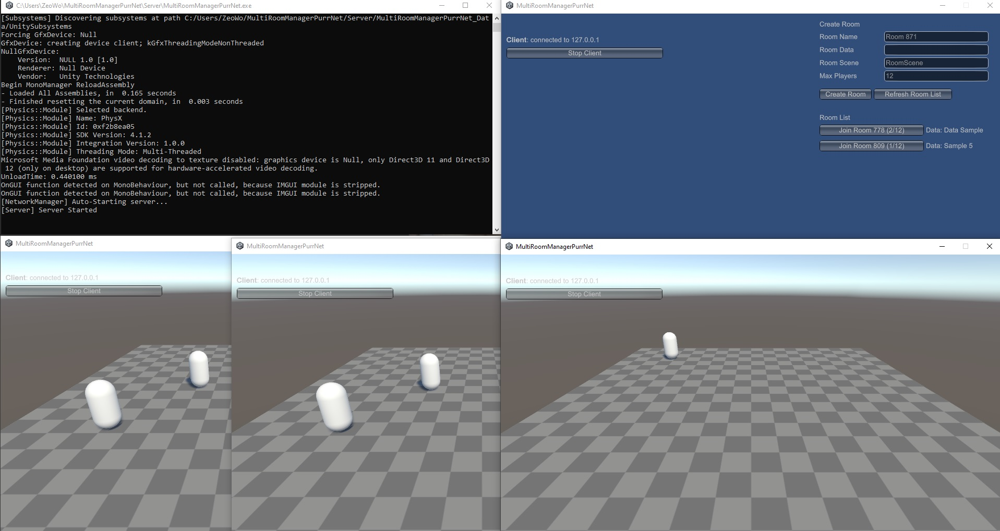

# PurrNet Multi‑Room Manager

A lightweight, single‑server solution for PurrNet that lets you run **multiple isolated game rooms** on one server using PurrNet's built in scene isolation.  
Players connect to a lobby and can join or create rooms (with custom name, data string, scene, max‑player count). Each room will have all network traffic (spawns, RPCs, transforms) scoped only to that room's scene.

Think of this solution as a server authoritive (and free) alternative to Photon.
This solution follows the KISS design principle (Keep it simple, stupid).
If you want your project to have a lobby, multiple games (rooms) running isolated from one another and without the worry of running multiple servers, then this is for you.

In order to set up the example; set "LobbyScene" as scene 0 and "RoomScene" as scene 1 in the build settings scene list.
You will also need to change "Active Input Handling" to "Both" or "Input Manager (Old)" in the player settings. 

**Features**  
- Dynamic room creation & removal with automatic server‑side cleanup of scenes
- PurrNet scene isolation: players in Room A can’t see or affect Room B  
- Basic lobby example for creating a room or joining an existing room from the room list  
- Optional network lobby player spawning while in the lobby scene
- Auto‑unload of empty rooms and client room‑scene cleanup on disconnect
- Extra GUI component PurrNetNetworkManagerHUD.cs for development
- One server, one port, multiple isolated rooms

